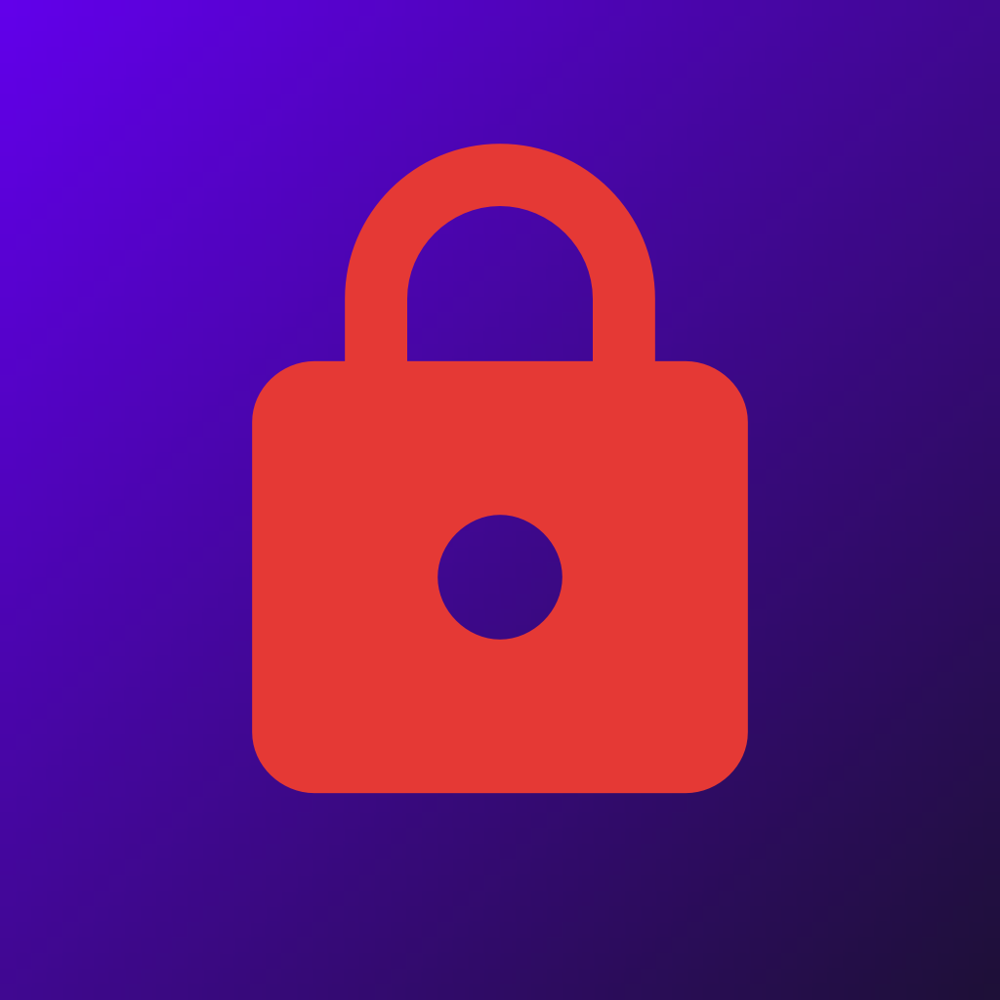

<div align="center">



# 🔐 Social Vault

**Caixa Forta Social** — bloqueja't l'accés a les teves xarxes socials fins que tu decideixis.

[](https://flutter.dev)
[](https://dart.dev)
[]()
[](https://github.com/Tumama28300/SocialVault/actions/workflows/deploy.yml)

**🌐 [Prova-la ara](https://tumama28300.github.io/SocialVault/)**

</div>

---

## ✨ Què és

Social Vault és una eina d'autocontrol digital: canvia la contrasenya d'Instagram, TikTok o X per una d'aleatòria i **segella-la** durant el temps que triïs. Fins que no passi el compte enrere, no la tornaràs a veure.

Cada xarxa social té el seu propi bloqueig independent — pots tenir Instagram bloquejat fins dissabte i TikTok obert, sense que interfereixin entre elles.

## 🚀 Com funciona

1. **Genera** una contrasenya aleatòria de 16 caràcters (`Random.secure()`).
2. **Copia-la i obre** la pàgina de canvi de contrasenya de la xarxa des de l'app.
3. **Tria quan es desbloquejarà** i **segella la caixa forta**.

A partir d'aquí, l'app mostra un compte enrere fins que arribi l'hora — moment en què es desbloqueja sola i et torna a mostrar la contrasenya.

## 🔒 Seguretat

- **Emmagatzematge xifrat** amb `flutter_secure_storage` (Keystore a Android, Keychain a iOS).
- **Bloqueig biomètric** a l'entrada de l'app (Face ID / empremta / PIN del dispositiu).
- **Historial de contrasenyes** amagat mentre una xarxa està segellada.
- **Sense còpies de seguretat automàtiques** (`android:allowBackup="false"`) perquè les dades xifrades no acabin en un backup del núvol.

> ⚠️ És una eina d'autodisciplina, no un sistema de seguretat contra tercers: canviar la contrasenya no tanca sessions ja iniciades en altres dispositius.

## 🛠️ Desenvolupament

```bash
flutter pub get
flutter run
```

Compilar la versió web (la que es publica a GitHub Pages):

```bash
flutter build web --release --base-href /SocialVault/
```

El desplegament a [GitHub Pages](https://tumama28300.github.io/SocialVault/) és automàtic via GitHub Actions ([`.github/workflows/deploy.yml`](.github/workflows/deploy.yml)) a cada push a `main`.

## 📁 Estructura

```
lib/
├── models/          → SocialNetwork, PasswordHistoryEntry
├── services/         → VaultService (emmagatzematge xifrat)
└── screens/
    ├── app_lock_screen.dart        → porta d'entrada biomètrica
    ├── home_screen.dart            → llista de xarxes
    ├── network_vault_screen.dart   → generar / segellar / compte enrere
    └── password_history_screen.dart
```
